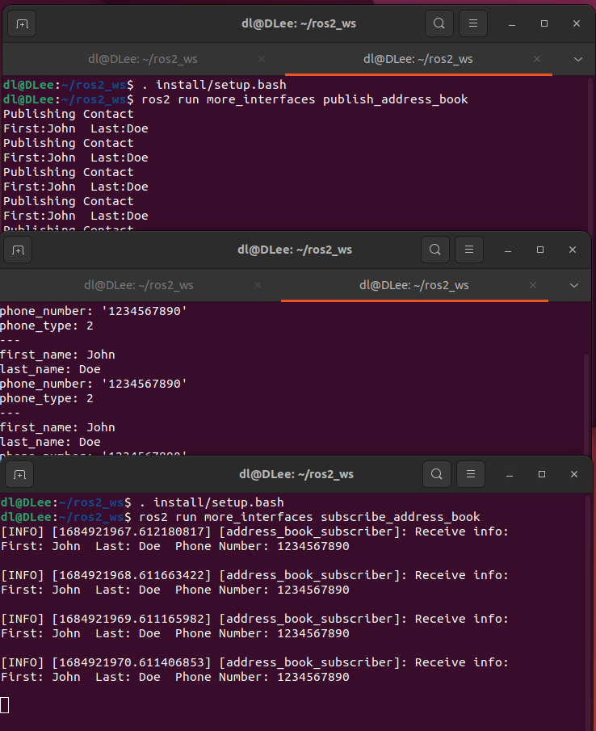

# 视觉组第一次考核
- [视觉组第一次考核](#视觉组第一次考核)
  - [软件学院 丁利](#软件学院-丁利)
  - [一、个人素质](#一个人素质)
  - [二、技术题目](#二技术题目)
    - [1. 科学上网](#1-科学上网)
    - [2. ubuntu使用](#2-ubuntu使用)
    - [3. ROS2系统](#3-ros2系统)
    - [4. ROS2 Navigation2](#4-ros2-navigation2)
    - [5. OpenCV](#5-opencv)
    - [6. 卡尔曼滤波](#6-卡尔曼滤波)
    - [7. 相机模型](#7-相机模型)
    - [8. CMake操作](#8-cmake操作)
    - [9. Git](#9-git)
    - [10. Pytorch深度学习](#10-pytorch深度学习)

## 软件学院 丁利
 

## 一、个人素质
1. 简单介绍下自己，描述一下以往项目经历(大创/比赛/课程项目)，重点在于你自己做了哪部分工作，收获了哪些知识，有哪些经验教训。
   - **我是软件学院2021级的学生。我本来在高考结束选专业的时候是冲着软件工程专业好就业的特点报考这个专业的，但在进入大学学习了两年之后，我发现我很热爱我所学的专业。我在github上有两个暑假开始做的个人项目，一个是跟着Youtube上一个博主做的c++游戏引擎项目，一个是c++写的简单的青年大学习学习记录统计工具。同时，我现在作为项目负责人在做校级大创（关于深度学习去雨）和中国软件杯（关于医学图像语义分割和三维建模）。我在做这些项目的过程中学到了很多东西，积累了很多经验，我觉得其中最重要的是团队协作的技巧和软件工程架构设计，我认识到编码往往是在完成了大量的前期准备工作后做起来最顺利的一步，工程设计和任务分工才是完成一个大型项目最困难的部分。我在做项目的过程中也充分探索了自己的兴趣爱好，发现了自己感兴趣的研究领域。**
2. 你入队的目的是什么？希望Robomaster（RM）机甲大师赛能带给你 什么？是兴趣、保研加分、还是希望掌握更多技能？亦或是想丰富自己的阅历，认识更多人？
   - **说实话，去年参加RM初试的经历是我发现自己所热恋领地的重要契机。我仍然清楚地记得去年夏天白天军训结束晚上回去学习RM的场面（笑。在一次自学一个陌生人的领地然后写出能实现预期功能的代码后来，我发现我还挺喜欢自己正确在做的事。但遗失的是，因为大二课业压力和大创造压力有点大，再加上我预感到自己还是太菜了，我在复试的时候放弃了加入RM。现在，我想在大三的时候实现加入RM梦想，我希望自己能在火锅和志同道合的朋友们一起为相同的目标工作，学习大佬的技术经验，认识纯熟的朋友。**
3. 你了解rm有哪些兵种，每个兵种视觉组分别有什么任务，视觉导航组的工作会对这些兵种有什么提升。
   - **RM有步兵、英雄、工程、哨兵、飞镖、无人机等兵种，视觉组的任务主要是开发辅助步兵和英雄操作手瞄准目标的系统和为哨兵开发自动化系统。视导组的工作可以为操作手提供自瞄外挂提高射击精准度和效率，可以把哨兵机器人打造成拥有无敌时间的自动作战机器。**
4. 你对 Robomaster（RM）机甲大师赛 了解多少？可以上B站观看近几年比赛或者纪录片视频，谈谈你对这个比赛的理解与你的优势（比如你是FPS、MOBA游戏大神，或者你对赛制有独到的见解等等）。
   - **我觉得这个比赛的基础是技术，拉开队伍之间差距的主要因素也是技术，因此队伍内部人员之间技术的交流和继承很重要。其次是团队协作，RM不可能是一个或几个人的比赛，因此保持良好的团队氛围十分重要。最后是策略，我看了许多实战回放，如果两队技术差距不大，那么决定比赛胜负的关键往往是策略，根据规则的特点、自身的特点和对手的特点制定对应的策略能取得更大的优势。我的优势是有一些项目开发经验，或许可以和大家更好地合作。**
5. 人的时间和精力总是有限的。如果在课程学习与 RM、或者是其他比赛项目与 RM 冲突时，你会怎么选择？
   - **我大三大四没有专业课了，只有选修课，因此有大量的空闲时间。那么如果我的其他比赛项目和RM冲突，我会根据不同的情况作出选择：当其他比赛和RM正式比赛冲突时，我会选择参加RM正式比赛；当RM研发进度和其他比赛项目的结题答辩或提交作品ddl冲突时我会和战队协商解决冲突，但我会尽量避免这种情况出现。**
6. 团队队员之间总是有思想碰撞与冲突的。当队内其他队员与你发生冲突时，你会怎么解决？当其他人进度滞后时（摸鱼摆烂），你会怎么做？
   - **就我如果是一名普通队员而言，如果遇到上述两种情况，我会尽力和那些队员沟通，如果实在无法解决，我会寻求组长或队长的帮助；就我如果是组长或队长而言（狗头），这是一个管理学的问题，我会根据实际情况作出最有利于战队的决定（比如如果是技术观点的冲突，我的首要处理思路是在不打击任何一名队员的研发积极性的同时选择最好的技术观点。）**
 

## 二、技术题目
- **我的github仓库链接 https://github.com/DLee0102/2024_vision_firsttest**
### 1. 科学上网
- 我使用的是以V2ray为核心，QV2ray为GUI界面的代理服务器，订阅链接是用的TLY公司的免费链接

  
### 2. ubuntu使用
- cd、vim、apt、rm、cp、mv、wget、curl、cat、ls、pwd、service

- vim：用vim编辑器打开文件

- apt：管理软件包

- rm：删除文件（或文件夹）

- cat：复制文件内容

- wget：通过url下载文件

- 通过url下载

- ls：列出当前目录下的所有文件（文件夹）

- mv：移动文件（文件夹）

- 显示当前目录的路径

- rm：删除文件（或文件夹）

- 管理进程

- export添加环境变量只在当前终端中有效
### 3. ROS2系统
- 安装：
  - 考核之前已按照官方文档安装ROS2系统，因此未截屏记录安装过程。
  - 验证安装
  
- 使用turtlrsim和rqt

- 创建工作空间

- 编写发布节点和订阅节点，代码见附件

- 编写服务端和客户端，代码见附件

- 编写客制化接口并实现（通过echo监听发布节点，自编写订阅节点），代码见附件

- 从launch文件启动，代码见附件

- 制作插件包，代码见附件

### 4. ROS2 Navigation2
- **我在学习过程中发现如果要用turtlebot3来跑Nav2的示例需要先学习ros机器人仿真URDF，因此以下还记录了学习机器人仿真的过程，并使用按照教程重新建模仿真的机器人完成了Nav2的初步学习**
- 1. 安装配置好环境后运行Nav2的测试demo
  
- 2. 完成机器人建模

- 3. 完成机器人仿真环境搭建（实现了一些基本传感器比如雷达等的建模和动力学物理量的建模）

- 4. 在Gazebo仿真环境中使用SLAM建图来为Nav2导航进行建模

- 5. 使用前一步骤建好的图来运行简单的Nav2导航demo

### 5. OpenCV
- 二值化

- 膨胀

- 腐蚀

- 滤波

- Canny边缘检测

### 6. 卡尔曼滤波

### 7. 相机模型

### 8. CMake操作
- 1. hello-CMake

- 2. 包含头文件

- 3. 包含静态库

- 4. 包含动态库

- 5. 设置构建类型

- 6. 设置编译方式

- 7. 包含第三方库

- 8. 使用clang编译工程
- 教程示例用的是clang++-3.6进行编译，但我的Ubuntu22.04貌似不支持这一版本的clang++，只能安装clang++14,而这一版本的clang++14已不再支持stdc++库，在使用cmake编译时会报错，目前我还没找到解决办法。

- 9. 使用ninja构建工程

- 10. 导入目标

- 11. C++标准

### 9. Git
- 1. 建立github远程仓库

- 2. 将远程仓库克隆到本地

- 3. 使用git add来向仓库中添加文件

- 4. commit

- 5. push

- 6. 创建测试分支

- 7. 合并分支

- 8. 解决冲突

- 9. pull

- 10. pull request
  - 我在PaddlePaddle仓库提交了一个pullrequest
   
### 10. Pytorch深度学习
- 简单说明：网络架构为一个残差网络模块接一个全连接层（采用简单的架构以避免过拟合），优化器为Adam，损失函数为交叉熵损失，epoch为100；经过多次实验发现batch_size设置为1024时可以获得比较理想的训练效果。
- 训练结果（tensorboard展示，也可以直接用tensorboard打开附件中的日志文件）

- 训练过程截图
