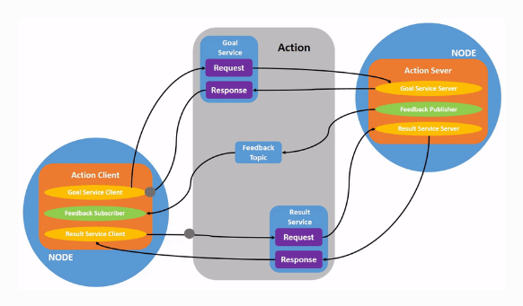

# ROS2学习笔记

## 节点
- 相当于是一个通讯实体，一个节点可以有多个对外开放的话题。
## 话题
- 可以理解为节点对外开放的接口，某个节点对外开放（订阅）的话题允许被其他节点subscribe，然后消息被订阅了该话题的节点接收。
## 服务
- 一个服务可以有多个客户端，但只能有一个服务端。
- 话题是发布-订阅模式，服务是C/S模式，一般来说服务不用于连续的访问，话题更适合于发出连续的访问
## 参数
- 可以理解为节点的一些设置；参数可以是整型、浮点型等各种类型的数据；ROS中每个节点都有维护其自己的参数
- 只读参数只能在创建节点时被设置，其余参数可在任意时刻被设置；
- 参数可存储在.yaml文件中
## 动作
- 适合长时间运行的任务
- A robot system would likely use actions for **navigation**.
- An action goal could tell a robot to travel to a position. While the robot navigates to the position, it can send updates along the way (i.e. feedback), and then a final result message once it’s reached its destination.
- 
## 使用rqt_console查看日志
- The default level is Info. You will only see messages of the default severity level and more-severe levels.
## 一次加载多个节点
- Once you learn to write your own launch files, you’ll be able to run multiple nodes - and set up their configuration - in a similar way, with the ros2 launch command.
## 记录和复现的工具
- 
## 使用 colcon 来构建包
- **colcon build --symlink-install** 后缀可以加快构建速度（This allows the installed files to be changed by changing the files in the source space (e.g. Python files or other non-compiled resources) for faster iteration.）
- **colcon build --packages-select my_package**构建指定包
- When colcon has completed building successfully, the output will be in the **install directory**. 
- Before you can use any of the installed executables or libraries, you will need to add them to your path and library paths. **colcon will have generated bash/bat files in the install directory** to help set up the environment. 
- If you do not want to build a specific package place an empty file named **COLCON_IGNORE** in the directory and it will not be indexed.
## 创建工作区
- 思想：Overlay和Underlay
  - Overlay是单独的小的工作空间
  - Underlay是总的ROS2安装空间
  - Overlay是建立在Underlay的基础之上的
- 创建包后构建的步骤
  - 写代码
  - 修改CMakeLists.txt和package.xml文件
  - 新建一个终端窗口，source源环境（否则可能报错ament_cmake找不到），然后colcon build
  - 新建一个终端，source install/setup.bash(or: . install/setup.bash)，也可以运行 source /opt/ros/humble/setup.bash + 
  source install/local_setup.bash
  - ros run 运行
- **Before sourcing the overlay**, it is very important that you **open a new terminal**, separate from the one where you built the workspace. Sourcing an overlay in the same terminal where you built, or likewise building where an overlay is sourced, may create complex issues.
- Sourcing the **local_setup** of the overlay will only add the packages available in the overlay to your environment. **setup** sources the overlay as well as the underlay it was created in, allowing you to utilize both workspaces.

- So, sourcing your main ROS 2 installation’s setup and then the ros2_ws overlay’s local_setup, like you just did, **is the same as** just sourcing ros2_ws’s setup, because that includes the environment of its underlay.
- **Ubuntu不会把 /桌面 自动解析为/Desktop**
## 创建包
- cmake规范的层级架构my_package/
     CMakeLists.txt
     include/my_package/
     package.xml
     src/
- You can also have packages of **different build types** in one workspace
## 第一个pubsub程序
- . install/setup.bash 中.可以替代source来引用环境
- 关于shared_ptr\unique_ptr和auto_ptr
  - shared_ptr: 使用计数法来避免重复删除同一块内存
  - unique_ptr: 同时只允许一个unique_ptr指针指向同一块内存，若此时有另一unique指针指向该内存，则消除前一指针内存储的内存地址（这会导致产生悬挂指针，会在编译阶段就报错（但赋值为函数返回值不会报错，因为这是安全的））
  - auto_ptr：和unique_ptr使用相同的原理，但不会在编译阶段报错，因此该方法不完善。
## 实现定制化接口
- You can use set in CMakeLists.txt to neatly list all of your interfaces:
```cmake
set(msg_files
  "msg/Message1.msg"
  "msg/Message2.msg"
  )

set(srv_files
  "srv/Service1.srv"
  "srv/Service2.srv"
  )
```
- And generate all lists at once like so:
```cmake
rosidl_generate_interfaces(${PROJECT_NAME}
  ${msg_files}
  ${srv_files}
)
```
- 以下CMake代码仅在你需要在同一个包中使用定制化接口时才添加
```cmake
rosidl_get_typesupport_target(cpp_typesupport_target
  ${PROJECT_NAME} rosidl_typesupport_cpp)

target_link_libraries(publish_address_book "${cpp_typesupport_target}")
```
- (Extra) Use an existing interface definition
## Using ros2doctor to identify issues
- ros2doctor只能用于检查系统环境，不能检查代码错误
## Creating and using plugins 
- With pluginlib, a constructor without parameters is required, so if any parameters to the class are needed, we use the initialize method to pass them to the object.
## 插件
- 插件能从运行时库中动态加载类，而不需要显式链接